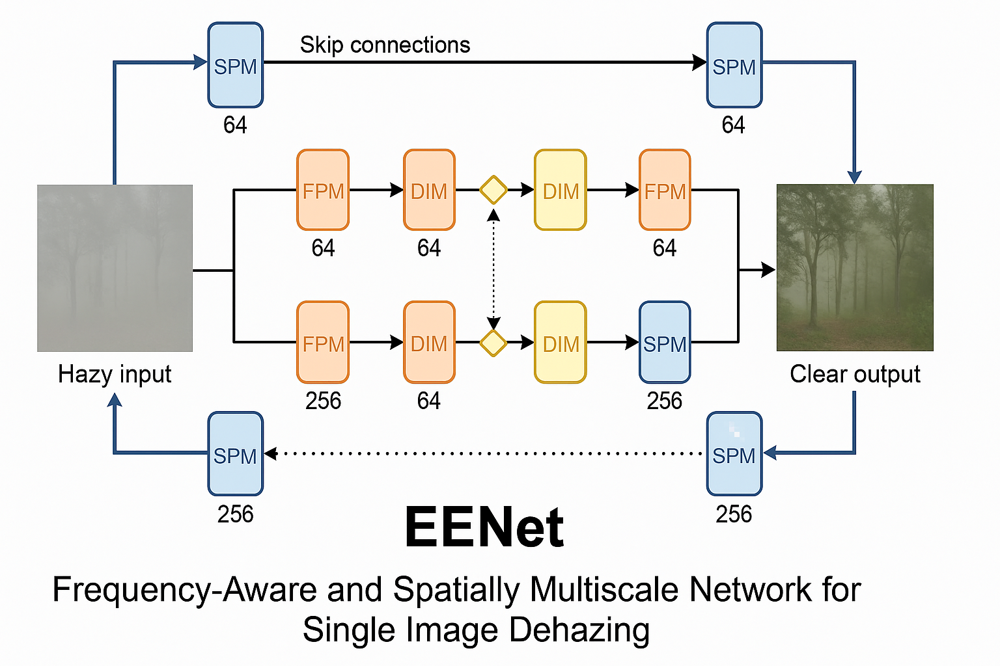
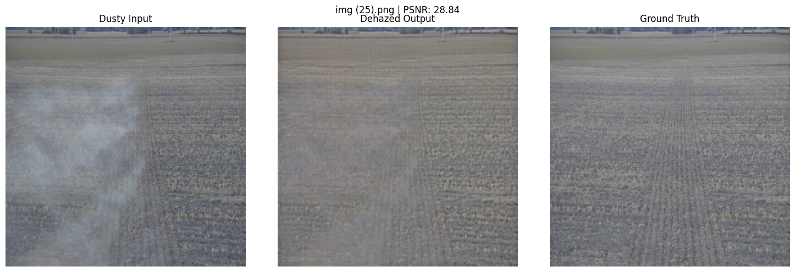
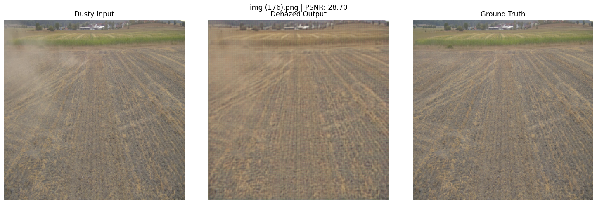
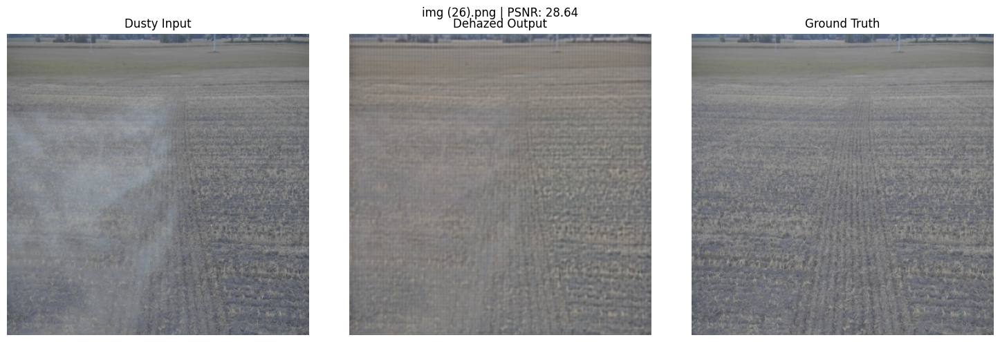
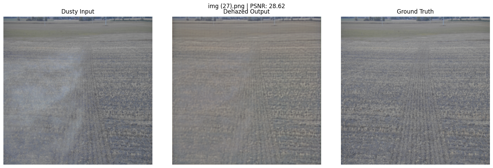
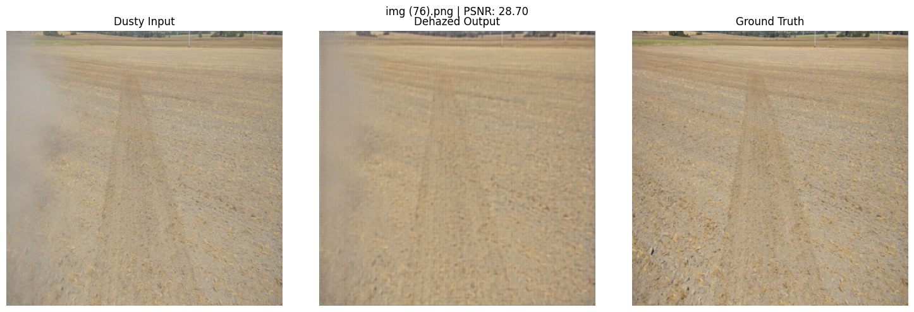

# EENet-Dehazing

[](https://paperswithcode.com/sota/image-dehazing-on-rb-dust?p=eenet-frequency-aware-and-spatially)


This repository contains a PyTorch implementation of **EENet**, a dual-domain network that integrates frequency-aware and spatial multiscale features for single image dehazing. The model is trained on RESIDE-6K and fine-tuned on the RB-Dust industrial dataset.

This is a simplified implementation of the published design and is separate from the authors' official code, which is available at [github.com/c-yn/EENet](https://github.com/c-yn/EENet).

---

## 🧠 Model Overview

EENet leverages:

- **Frequency Processing Modules (FPM)** using FFT-based convolution
- **Spatial Processing Modules (SPM)** with residual CNNs
- **Dual-Domain Interaction Modules (DIM)** to fuse frequency and spatial features
- A U-Net-style encoder-decoder structure with skip connections

---

## 🧬 Model Architecture

Below is a schematic diagram of the EENet model architecture, showing its dual-domain structure with frequency and spatial processing modules.



---

## 📦 Pretrained Model

You can download the pretrained model directly from Kaggle using the following command:

```bash
kaggle models instances versions download moshtaghioun/eenet/pyTorch/default/1
```

Unzip the file and place `best_eenet.pth` in your working directory.

---

## 🚀 Usage

```python
import torch
from model.eenet import EENet

model = EENet()
model.load_state_dict(torch.load("best_eenet.pth", map_location="cuda"))
model.eval()

# Input: Tensor of shape [B, 3, 256, 256] normalized to [0, 1]
# Output: Tensor of shape [B, 3, 256, 256] (dehazed output)
```

For full training, evaluation, and visualization scripts, see the [scripts](scripts/) directory.

---

## 📊 Evaluation Results

| Dataset   | PSNR ↑ | SSIM ↑ |
|-----------|--------|--------|
| RESIDE-6K | 21.45  | 0.81   |
| RB-Dust   | 24.72  | 0.7015 |

---

## 🖼 Sample Results

Below are composite visualizations showing dusty input images, EENet outputs, and ground truth side-by-side.








---

## 🧪 Datasets

- [RESIDE-6K](https://github.com/nttcslab/RESIDE) — synthetic outdoor haze dataset
- **RB-Dust** — real-world industrial dust dataset (custom, private)

---

## 📑 Reference

This work is based on the following paper:

> **"EENet: An effective and efficient network for single image dehazing"**<br>
> *Yuning Cui, Qiang Wang, Chaopeng Li, Wenqi Ren, Alois Knoll*<br>
> Pattern Recognition, vol. 158, art. no. 111074, 2025.<br>
> [DOI: 10.1016/j.patcog.2024.111074](https://doi.org/10.1016/j.patcog.2024.111074)

---

## 👥 Contributors

- **Seyed Amirhossein Moshtaghioun**<br>
  🔗 [GitHub](https://github.com/amir1373) · 🌐 [Website](https://roboticswith.me)

- **Dr. Mehran Mehrandezh**<br>
  🏫 University of Regina · 📧 Mehran.Mehrandezh@uregina.ca

- **Dr. Ali Mohammadi**<br>
  📧 ali_mohammadi@yahoo.com

> Special thanks to the authors of the original EENet paper.

---

## 🪪 License

This implementation is released under the MIT License.<br>
Feel free to use, modify, and distribute — with credit.

---

## 🙋 Contact

For questions or contributions, feel free to open an issue or reach out via [https://roboticswith.me](https://roboticswith.me).
